# CSV Business Rules Engine

A design of business rules engine which handles business rules in CSV

### Feature

- Quickly create rules with lambdas
- Business rule configs stored in single table
- Business rule configs stored as files
- Cache and auto refresh cache of business rule configs
- Simple

### Config Service

- Config Service manages (store, update, retrieve, delete etc.) configurations (configs)
- Configs can be String of json, csv or any other format
- Configs can be stored in DB or as files or extended to other medias e.g. git
- Additional features can be added to Config Service, e.g. UI for business users to edit / approve
- It can be deployed as a microservice similar to Spring Cloud Config
- There are 2 options to refresh the config 
- a. Whenever there is an update to the config, notify the clients (Clients need to provide / implement an API)
- b. Clients to check with Config Service periodically e.g. every 10s, 1min, 10min etc. And then clients can update its own cache
- To improve the performance, Config Service can provide an API to retrieve only summary of the config, in case the config itself is too large

### Rule Config

- Rule Config is a kind of config, can be retrieved from ConfigService
- Rule Config is NOT Rule, it's the metadata to be used when defining a Rule
- Usually the business rules are stored as a table in Excel / CSV.
  This CSV is treated as a **Rule Config**
  When parsing the CSV, one record can be read as:
  > when (columnA = x and columnB = y) then use columnC
- CSV format can be converted to JSON for application to process and store
- JSON is for UI to render as a table for user to edit
- JSON can be persisted as files or in database
- If stored in database, different kinds of JSON will be store in one single table
- By saving different versions of JSON into database, the application can support versioning
- Rule config is OPTIONAL, it's not mandatory when creating a Rule
- Other data types can be added by adding new parsers
- The RuleConfigService supports cache and auto refresh cache of Rule Config 

### Rule

- A Rule contains conditions("when") and actions("then", "otherwise"), and returns a Result
- When defining a Rule, it's usual to use Rule Config, but not mandatory
- There are 2 approaches to create a rule:
- a. Create a java class to implement the Rule interface
- b. Use the DefaultRuleBuilder to build a rule.

### "Fact"

- A "Fact" is a runtime object instance to be checked against / applied on a rule
- To prevent creating different java classes for different types of fact, Jackson library's JsonNode is used as the type
  for fact

### RuleEngine

- A component combines Rule and Fact, and kick off the processing.

### Result

- A result contains the rule's name, processing result, and a remark

### Reference

- Martin Fowler's [RulesEngine](https://martinfowler.com/bliki/RulesEngine.html)
- [Easy Rules](https://github.com/j-easy/easy-rules) 
- [Using Redis to store configuration information](https://redis.com/ebook/part-2-core-concepts/chapter-5-using-redis-for-application-support/5-4-service-discovery-and-configuration/5-4-1-using-redis-to-store-configuration-information/)