# CSV Business Rules Engine

A design of business rule engine which handles business rules in CSV

### Feature

- Quickly create rules with lambdas
- Business rule configs stored in single table
- Business rule configs stored as files
- Cache and auto fresh cache of business rule configs
- Simple

### Rule Config

- Usually the business rules are stored as a table in Excel / CSV.
  This CSV is treated as a **Rule Config**
  When parsing the CSV, one record can be read as:
  > when (columnA = x and columnB = y) then use columnC
- CSV format can be converted to JSON for application to process and store
- JSON is for UI to render as a table for user to edit
- JSON can be persisted as files or in database
- If stored in database, different kinds of JSON will be store in one single table
- By saving different versions of JSON into database, the application can support versioning
- Rule config is OPTIONAL, it's not mandatory when creating a Rule
- Other data types can be added by adding new parsers

### Rule

- A Rule contains conditions("when") and actions("then", "otherwise"), and returns a Result
- There are 2 approaches to create a rule:
- a. Create a java class to implement the Rule interface
- b. Use the DefaultRuleBuilder to build a rule.

### "Fact"

- A "Fact" is a runtime object instance to be checked against / applied on a rule
- To prevent creating different java classes for different types of fact, Jackson library's JsonNode is used as the type
  for fact

### RuleEngine

- A component combines Rule and Fact, and kick off the processing.

### Result

- A result contains the rule's name, processing result, and a remark

### Reference

- Martin Fowler's [RulesEngine](https://martinfowler.com/bliki/RulesEngine.html)
- [Easy Rules](https://github.com/j-easy/easy-rules) 